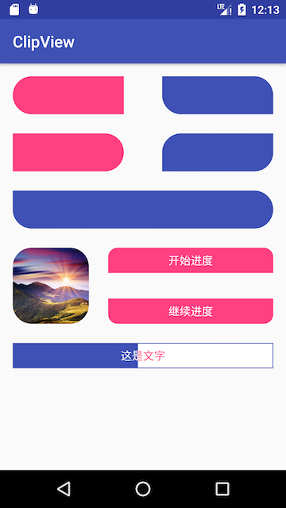

## 简介

这是使用Canvas的clipPath方法实现的圆角View，在本库中提供了个人认为常用的几个View如下几种：

* RadiusFrameLayout
* RadiusLinearLayout
* RadiusRelativeLayout
* RadiusTextView
* RadiusImageView

效果如下：



废话不多说，直接来看看怎么用吧～

## 使用

### 引用：

在根目录级的build.gradle中添加

```
allprojects {
	repositories {
		...
		maven { url 'https://jitpack.io' }
	}
}
```

再在要使用的项目级的build.gradle中添加：

```
dependencies {
	compile 'com.github.arvinljw:ClipView:v1.0.1'
}
```

### api介绍

首先这些都是自定义View，它们都具有自定义属性：

```
<attr name="radius" format="dimension"/>
<attr name="radius_left_top" format="dimension"/>
<attr name="radius_left_bottom" format="dimension"/>
<attr name="radius_right_top" format="dimension"/>
<attr name="radius_right_bottom" format="dimension"/>
```

| xml           | 代码           | 含义  |
|:------------- |:-------------| :-----|
| app:radius="dimen"                 | view.setRadius(int radius)        | 设置各个角的圆角 |
| app:radius\_left\_top="dimen"      | view.setRadiusLeftTop(int rlt)      |   设置左上角圆角 |
| app:radius\_left\_bottom="dimen"   | view.setRadiusLeftBottom(int rlb)      |   设置左下角圆角 |
| app:radius\_right\_top="dimen"     | view.setRadiusRightTop(int rrt)      |   设置右上角圆角 |
| app:radius\_right\_bottom="dimen"  | view.setRadiusRightBottom(int rrb)      |   设置右下角圆角 |


补充说两点：

* 代码设置这些角是有顺序的，后边的会覆盖前边的，例如先设置了setRadius为10，这时候每个角的大小都是10，然后再设置setRadiusLeftTop为0的话，那么左上角圆角大小就变成0了，其他的还是10。
* 代码设置圆角并不会自动重新绘制View，需要自己手动去调用invalidate()等重绘的方法，因为自动调用的话，如果连着设置几个角，就会被调用几次，那样肯定是浪费资源的，而又不好控制，所以就放弃了自动绘制。

### 扩展

当然最重要的是我把核心功能封装到了RadiusUtils中，在以上的各个View中的代码几乎都一样，都是调用RadiusUtils中的方法，所以本库中没有提供的，而你又有新的需求，即可参照以上几个View去实现即可。

### todo

如果想要设置boder，还是不方便，如果需要去写个drawable，那大多时候都用不着本库中提供的方法，所以计划之后会提供绘制border相关的属性。

## License

```
Copyright 2017 arvinljw

Licensed under the Apache License, Version 2.0 (the "License");
you may not use this file except in compliance with the License.
You may obtain a copy of the License at

  http://www.apache.org/licenses/LICENSE-2.0

Unless required by applicable law or agreed to in writing, software
distributed under the License is distributed on an "AS IS" BASIS,
WITHOUT WARRANTIES OR CONDITIONS OF ANY KIND, either express or implied.
See the License for the specific language governing permissions and
limitations under the License.
```

